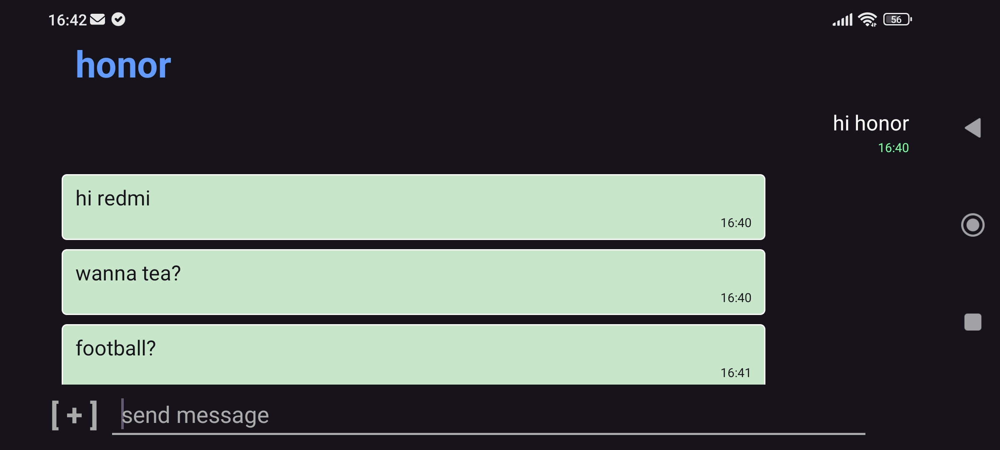

[](https://play.google.com/store/apps/details?id=com.safelogj.lim)
[](https://www.youtube.com/watch?v=Rf0qV1bF3Vc&list=PLDrcG0N5RKyo)

# Lim: Messenger for MikroTik


A lightweight messenger for local networks based on MikroTik CHR.

The project consists of two parts:

- Android client
- Java server running inside a MikroTik CHR container

The server stores messages, transfers media files and manages user accounts. Communication between clients takes place only through your own CHR server.

---

## Features

- Personal messaging
- **Secure Voice Calls (E2EE)**
- File transfer & Voice messages
- End-to-end encryption of messages, media and voice
- Automatic chat creation
- User authentication
- Android client (API 29+)
- Java server for MikroTik (AMD64 & ARM64)
- HTTPS communication
- Local network operation only

---

## No external services

Lim does not use Google Firebase, FCM, MQTT brokers or any other third-party messaging services.

The server never initiates connections to Android devices.

Because Android does not allow background applications to keep permanent network connections without push services, the client periodically polls the server for new messages.

The minimum polling interval available while the application is in the background is **15 minutes**.

This limitation is imposed by the Android operating system for applications that do not rely on push notification services.

---

## Real-time notifications (MikroTik trick)

To receive messages faster than every 15 minutes while in the background, you can use a trick with your MikroTik router.

### How it works
Android OS monitors network properties. When the DNS server list changes in your Wi-Fi network, Android triggers a system event `onLinkPropertiesChanged`. Lim listens for this event and performs a quick check for new messages.

### MikroTik Script (DNS Toggling)
You can create a script on your MikroTik router that toggles between two sets of DNS servers. This is a "soft" trigger that works well when the device is not in deep sleep.

```routeros
:local netId [/ip dhcp-server network find address="192.168.88.0/24"];
:local currentDns [/ip dhcp-server network get $netId dns-server];
:if ($currentDns = "192.168.88.1,8.8.8.8") do={
    /ip dhcp-server network set $netId dns-server="192.168.88.1,8.8.4.4";
} else={
    /ip dhcp-server network set $netId dns-server="192.168.88.1,8.8.8.8";
}
```
### Setup Instructions
1. **Scheduler**: Add script to `/system scheduler` to run at your desired interval (e.g., every 3 minutes).
2. **DHCP Lease Time**: If using the DNS trick, set your DHCP server's `Lease Time` to **double the script interval** (e.g., 6 minutes for a 3-minute script).
3. **Battery Optimization**: **Crucial!** Disable battery optimization for the Lim app in Android settings. Without this, Android will ignore most network events during Doze mode.


This method allows your phone to "wake up" and check for messages as often as the script runs, bypassing the standard 15-minute background limitation.

---

When the application is open, messages are exchanged immediately.

---

## How it works

Each user registers on the server using a username and password.

The server never stores the user's password.

The Android client hashes the password before sending it to the server. The server hashes the received value again and stores only this double hash for authentication.

To start a conversation, enter the recipient's username.

If the chat does not exist, the server creates it automatically.

---

## User Interface & Interaction (How to use)

The Lim interface is designed for simplicity and focuses on direct actions. Here are the core interaction patterns:

- **Registration**: To register on your server, provide the server IP address, choose a unique Login and Password, and set your Display Name.
- **Creating a Chat**: Go to **New Chat** and simply send the recipient's **Login** into the text field. The server will automatically link you.
- **Voice Messages**: Long-press the **Add File** (clip) button to record and send a voice message.
- **Voice Calls**: Tap the **Cloud Icon** at the top of the chat screen to start an E2EE voice call.
- **Online Status**: The **Cloud Icon** also serves as an indicator — it changes color when the interlocutor is online.
- **Sending Messages**: After typing your text, click the **area to the right** of the input field to send (minimalist button).
- **Managing Chats**: Perform a **Long-press** on any chat in the main list to edit its properties or delete it.
- **Copying Text**: To copy a message's content to the clipboard, perform a **Long-press** directly on the message text.

---

## Encryption

Each user generates their own public/private key pair.

The server stores only public keys.

When sending a message or media file:

- the client requests the recipient's public key;
- text messages are encrypted with the recipient's public key;
- media files and file names are encrypted before uploading;
- only the recipient can decrypt the content.

The server cannot decrypt user messages or transferred files.

Usernames and chat names are stored unencrypted because they are required for routing messages.

---

## Voice Calls

Lim provides high-quality voice communication using the **Opus** codec. 

- **E2EE Privacy**: Voice data is encrypted directly on devices using AES-GCM. The server only sees encrypted UDP packets.
- **Relay Architecture**: The server acts as a high-performance UDP relay, routing traffic between participants without storing or recording it.
- **Low Latency**: Optimized for real-time communication in local networks and over VPN.
- **Multi-device support**: Calls can be received on multiple devices simultaneously (the first one to answer wins the session).

---

## Server certificate

The Android client can import the HTTPS certificate used by the CHR server.

After importing the certificate, all server connections are verified against it.

This allows the use of self-signed certificates without disabling certificate validation.

## Media files

Uploaded media files are stored temporarily on the CHR server.

After the recipient downloads the file successfully, it is automatically removed from the server.

This keeps storage usage low.

## Server Configuration

The server settings are stored in `db/server.properties`. You can tune them to fit your router's hardware.

| Parameter | Description | Default |
| :--- | :--- | :--- |
| `keystore.path` | Path to your SSL certificate (`.p12` file). | `db/limcert.p12` |
| `keystore.password` | Password for the SSL keystore. | - |
| `server.pool.size` | Number of worker threads. Use 4-8 for weak routers. | `8` |
| `server.queue.size` | Task queue size before rejecting new requests. | `2` |
| `db.connect.size` | Maximum number of simultaneous SQLite connections. | `8` |
| `server.media.quota.mb` | Software limit for the `media` folder size in Megabytes. | `50` |
| `server.disk.safe_margin.mb` | Minimum free disk space required to accept new files. | `20` |
| `udp.relay.port` | UDP port used for voice calls relay. | `41011` |

---

## Server storage

The server container uses two mounted directories.

```text
          Android Client
                │
          HTTPS │
                ▼
     +-----------------------+
     |    MikroTik Router    |
     |-----------------------|
     |     Java Server       |
     |     SQLite (HikariCP) |
     |     HTTPS Server      |
     +-----------------------+
                │
      ┌─────────┴─────────┐
      │                   │
    db/                media/
      │
      │                   
      ├── SQLite database 
      ├── HTTPS certificate
      └── server config
```

### db

Contains:

- SQL database (HikariCP)
- HTTPS certificate
- server configuration
- certificate password configuration

### media

Temporary storage for uploaded media files.

Files are automatically deleted after successful delivery.

---

## Server

The server is written in Java and packaged as a container for MikroTik (supports both CHR/AMD64 and hardware ARM64 devices).

It uses:

- Java
- HikariCP
- SQLite
- HttpsServer

---

## Client

The Android client is written entirely in Java.

Before sending requests, it verifies that the server address belongs to a private network.

Only local network addresses are accepted.

---

## Intended use

Lim is designed for users who already have their own MikroTik CHR server.

Typical scenarios include:

- home networks
- private VPNs
- small offices
- laboratory environments
- isolated local networks

---

## Project status

The project is under active development.

The protocol and functionality may change between releases.
___
### ❤️ Support

* Ozon : 2204 2402 5165 6593
* VISA : 4138 4601 5101 6667

* BTC (Bitcoin)  bc1q5xyw4d0rnue4e67dfme306dmq32tcqcfp4nldp
* ETH (Ethereum) 0xa3ae9d297c6dbc4b6db1cfc6d056ed86ca3209e6
* USDT (Ethereum) 0xa3ae9d297c6dbc4b6db1cfc6d056ed86ca3209e6
* USDC (Ethereum) 0xa3ae9d297c6dbc4b6db1cfc6d056ed86ca3209e6
* SOL (Solana) 4S8eZhQoKpSGfKdo8Bo8KYJR5F66xjAmanJfnvbjKgXB
* TWT (BNB Smart Chain) 0xa3ae9d297c6dbc4b6db1cfc6d056ed86ca3209e6
* BNB (BNB Smart Chain) 0xa3ae9d297c6dbc4b6db1cfc6d056ed86ca3209e6
___
